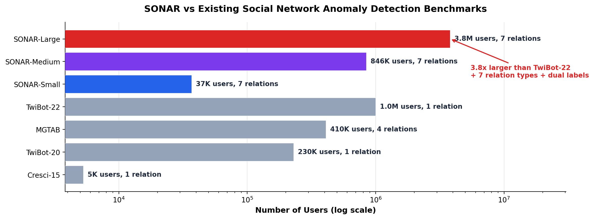
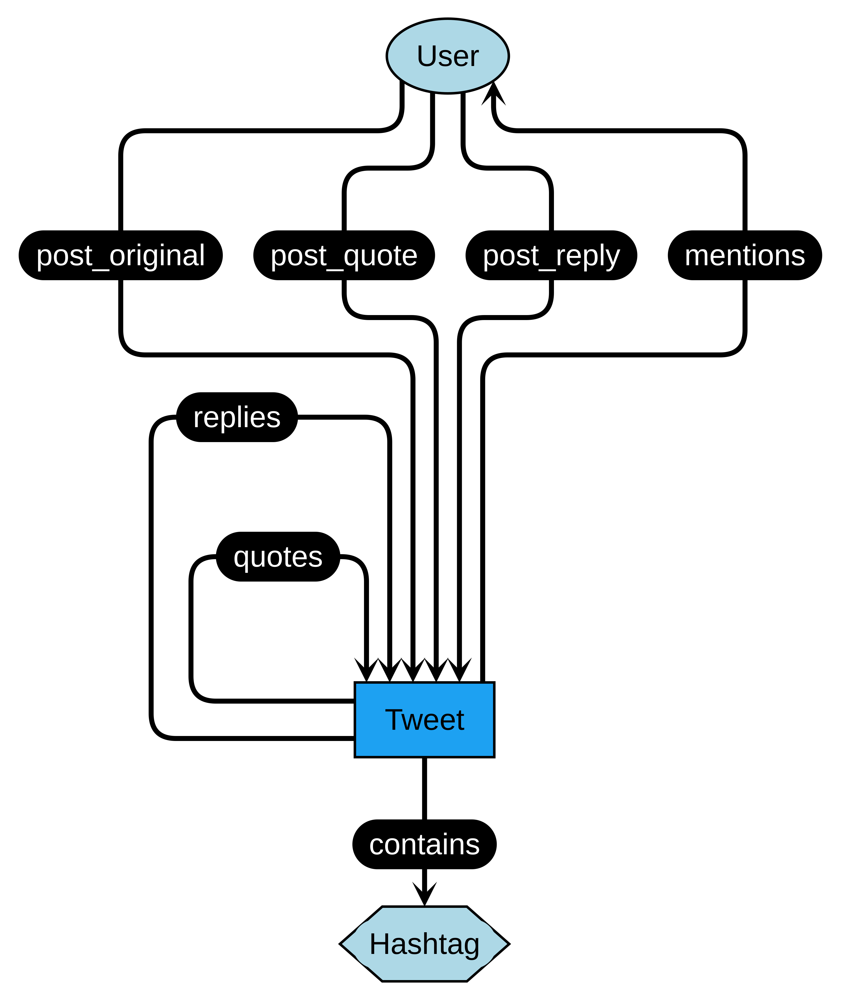
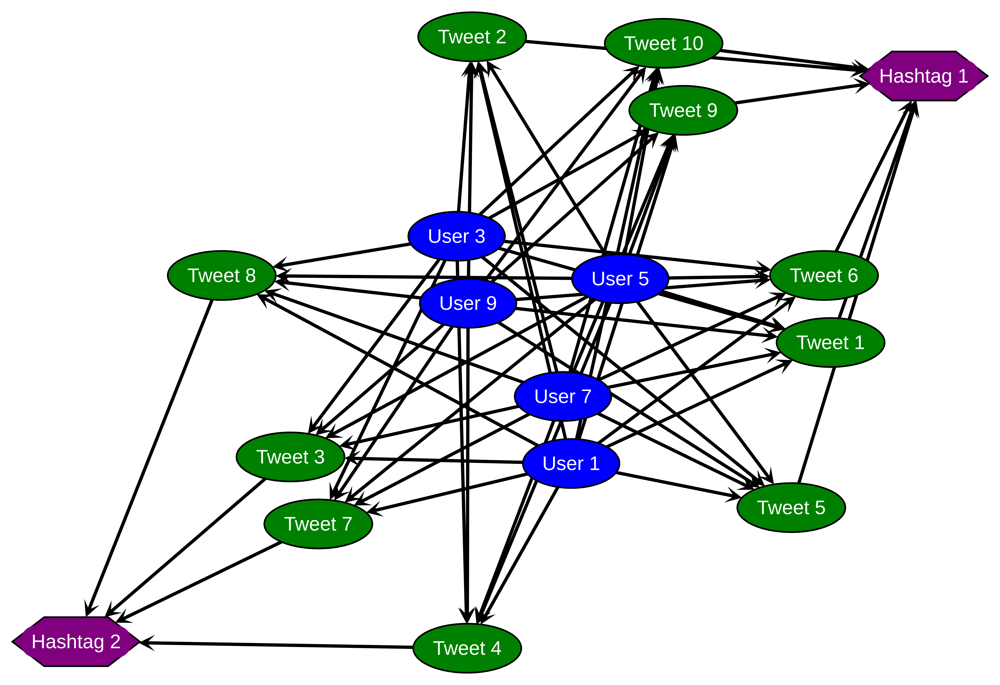
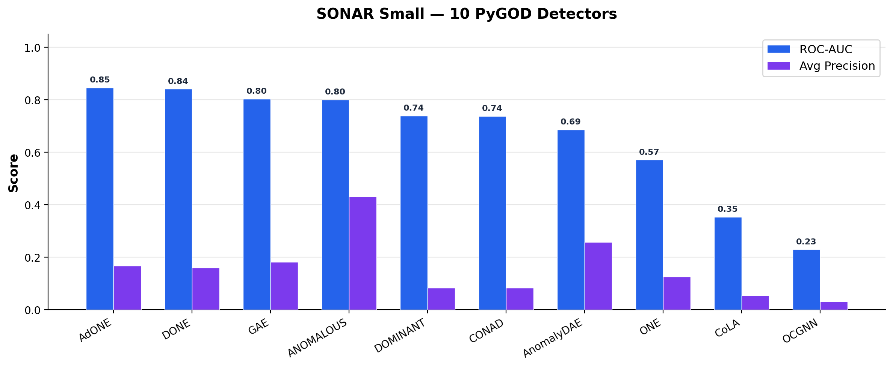

# SONAR: A Large-Scale Social Network Benchmark for Graph Anomaly Detection

[](LICENSE)
[](LICENSE-DATA)
[](https://www.python.org/downloads/)
[](https://pypi.org/project/sonar-graph/)

> Piridi et al. "SONAR: A Large-Scale Social Network Benchmark for Graph-Based Anomaly Detection." Submitted to SIGIR 2026.

**SONAR** (SOcial Network Anomaly Resource) is the largest publicly available heterogeneous graph benchmark for anomaly detection in social networks. Built from real X (formerly Twitter) data spanning 11 months of activity during the Indian Farmers' Protest, SONAR captures **3.8 million users**, **3.6 million posts**, and **7 relation types** — enabling the first systematic evaluation of graph anomaly detectors at realistic social network scale.

---

## Why SONAR?

Graph anomaly detection research is held back by benchmarks that are too small, too simple, and too homogeneous. Existing datasets top out at 1M users with a single relation type, while real social platforms have billions of users interacting through diverse mechanisms. No prior benchmark provides both large-scale authentic social network data and controlled anomaly ground truth at multiple granularities.

<details>
<summary><b>Comparison with existing benchmarks</b></summary>

| Dataset | Users | Relations | Heterogeneous | Anomaly Labels |
|---------|------:|:---------:|:-------------:|:--------------:|
| Cresci-15 | 5,301 | 1 | | User only |
| TwiBot-20 | 229,580 | 1 | | User only |
| MGTAB | 410,199 | 4 | &#10003; | User only |
| TwiBot-22 | 1,000,000 | 1 | | User only |
| **SONAR-Large** | **3,797,980** | **7** | **&#10003;** | **User + Post** |

</details>

<p align="center">
  
</p>

SONAR addresses four critical gaps:

1. **3.8x larger scale** than TwiBot-22 (3.8M vs 1M users), enabling evaluation at realistic social network sizes
2. **Rich multi-relational structure** with 3 node types and 7 edge types capturing the full spectrum of X/Twitter interactions (posting, replying, quoting, mentioning, hashtag usage)
3. **Dual-granularity anomaly labels** at both user and post level — the first social network benchmark to offer this — enabling fine-grained, multi-task evaluation
4. **Controlled anomaly injection** using established PyGOD methods: structural anomalies (coordinated cliques simulating bot networks) and contextual anomalies (attribute perturbations) at a 5% rate

---

## Dataset Overview

SONAR is available at three scales to support both rapid prototyping and scalability research:

| Variant | Users | Posts | Hashtags | Total Nodes | Edges | Anomalies |
|---------|------:|------:|---------:|------------:|------:|----------:|
| **Small** | 18,430 | 18,429 | 1 | 36,860 | 49,865 | 1,818 |
| **Medium** | 424,446 | 422,032 | 18 | 846,496 | 1,112,995 | 41,830 |
| **Large** | 3,797,980 | 3,611,869 | 152 | 7,410,001 | 10,204,721 | 365,861 |

### Graph Schema

<p align="center">
  
</p>

The heterogeneous graph models the full X/Twitter interaction spectrum:

| Edge Type | Source | Target | Semantics |
|-----------|--------|--------|-----------|
| `post_original` | User | Post | User authors a post |
| `post_quote` | User | Post | User quotes a post |
| `post_reply` | User | Post | User replies to a post |
| `quotes` | Post | Post | Post quotes another post |
| `replies` | Post | Post | Post replies to another post |
| `mentions` | Post | User | Post mentions a user |
| `contains` | Post | Hashtag | Post contains a hashtag |

The figure below shows an example subgraph from SONAR illustrating the multi-relational structure with users (blue), tweets (green), and hashtags (purple):

<p align="center">
  
</p>

### Node Features

| Node Type | Dim | Features |
|-----------|----:|---------|
| User | 4 | followers_count, following_count, listed_count, post_count |
| Post | 772 | repost_count, quote_count, like_count, post_type + 768-d Universal Sentence Encoder embedding |
| Hashtag | 1 | category label |

The **homogeneous representation** projects all nodes into a shared 16-dimensional feature space suitable for standard PyGOD detectors.

### Anomaly Types

SONAR injects two complementary anomaly types at a 5% rate:

- **Structural anomalies**: Coordinated cliques where selected users are fully connected to selected posts, simulating bot networks that artificially amplify content
- **Contextual anomalies**: Attribute perturbations using Euclidean distance maximization, simulating accounts with suspicious engagement metrics that deviate from their structural neighborhood

---

## Installation

```bash
pip install sonar-graph
```

---

## Quick Start

```python
from sonar import SONAR, dataset_summary, evaluate_detector

# Load small dataset (auto-downloaded, ~60MB)
dataset = SONAR(root="./data", name="small", anomalies=True)
data = dataset[0]

print(dataset_summary(data))
# {'type': 'homogeneous', 'num_nodes': 36860, 'num_edges': 49865,
#  'num_features': 16, 'num_anomalies': 1818, 'anomaly_ratio': 0.0493}

# Run a detector
from pygod.detector import DOMINANT
detector = DOMINANT(epoch=5, gpu=0)
detector.fit(data)
_, score = detector.predict(data, return_pred=True, return_score=True)

# Evaluate
print(evaluate_detector(data.y_outlier, score))
# {'roc_auc': 0.7384, 'average_precision': 0.0825, 'recall_at_k': 0.0286}
```

Load the **heterogeneous** variant to access the full multi-relational structure:

```python
dataset = SONAR(root="./data", name="small", anomalies=False,
                representation="heterogeneous")
data = dataset[0]
# HeteroData(user={x=[18430, 4]}, tweet={x=[18429, 772]}, hashtag={x=[1, 1]}, ...)
```

---

## Benchmark Results

We benchmark 10 PyGOD detectors spanning matrix factorization and GNN-based approaches on SONAR-Small:

<p align="center">
  
</p>

| Type | Detector | ROC-AUC | Avg Precision | Recall@k | Time (s) |
|------|----------|--------:|--------------:|---------:|---------:|
| Matrix Factor. | **ANOMALOUS** | 0.7997 | **0.4305** | **0.4455** | 11.76 |
| | ONE | 0.5705 | 0.1257 | 0.1430 | 17.79 |
| GNN-based | **AdONE** | **0.8459** | 0.1672 | 0.0875 | 16.12 |
| | DONE | 0.8407 | 0.1599 | 0.0721 | 15.92 |
| | GCNAE (GAE) | 0.8025 | 0.1806 | 0.1518 | 0.80 |
| | DOMINANT | 0.7384 | 0.0825 | 0.0286 | 15.85 |
| | CONAD | 0.7375 | 0.0824 | 0.0292 | 24.84 |
| | AnomalyDAE | 0.6858 | 0.2569 | 0.3388 | 16.15 |
| | CoLA | 0.3528 | 0.0544 | 0.1194 | 0.79 |
| | OCGNN | 0.2294 | 0.0315 | 0.0270 | 0.92 |

> **Note**: PyGOD's `GAE` implements a GCN-based autoencoder (GCNAE), not the variational GAE from Kipf & Welling (2016).

### Key Findings

- **Matrix factorization excels at precision**: ANOMALOUS achieves the highest AP (43.05%) and Recall (44.55%), demonstrating that joint attribute-network modeling effectively captures both structural and contextual anomalies.
- **GNN methods lead on ranking**: AdONE and DONE achieve the best ROC-AUC (84.59%, 84.07%), indicating that outlier-aware deep autoencoders with adversarial training produce superior anomaly rankings despite lower precision.
- **Efficiency varies 31x**: CoLA completes in 0.79s while CONAD requires 24.84s, highlighting significant runtime-accuracy trade-offs.

See `results/` for full JSON results.

---

## Reproducing Results

Run a single detector:
```bash
uv run python run_detector.py --dataset-name small --algorithm DOMINANT --epoch 5
```

Run all 10 detectors:
```bash
bash run_all.sh
```

Use a custom dataset:
```bash
uv run python run_detector.py --dataset path/to/graph.pickle --algorithm DOMINANT
```

Benchmark configurations (epoch, contamination, detector list) are documented in `benchmarks/configs/small.yaml`.

---

## Project Structure

```
sonar/                      # Python package (pip install sonar-graph)
  dataset.py                # PyG InMemoryDataset loader with auto-download
  utils.py                  # evaluate_detector(), dataset_summary()
tests/                      # pytest suite (17 fast + 4 slow tests)
notebooks/
  quickstart.ipynb          # Load, explore, detect, evaluate
  benchmark_analysis.ipynb  # Reproduce paper tables and figures
results/                    # Pre-computed benchmark results (JSON)
benchmarks/configs/         # Hyperparameter configurations
scripts/                    # Data conversion utilities
run_detector.py             # CLI benchmark runner
run_all.sh                  # Run all 10 detectors
```

---

## Dataset Access

| Variant | Access | Size |
|---------|--------|------|
| **Small** | Auto-downloaded via `SONAR` loader | ~60 MB |
| **Medium** | Contact authors (see below) | ~1.5 GB |
| **Large** | Contact authors (see below) | ~12 GB |

For medium and large variants, contact:
- **Hari Prasad Piridi** — p20210102@hyderabad.bits-pilani.ac.in
- **Dipanjan Chakraborty** — dipanjan@hyderabad.bits-pilani.ac.in

Please include your affiliation and intended use.

---

## License

- **Code**: [MIT License](LICENSE)
- **Data**: [Creative Commons Attribution 4.0 International (CC-BY-4.0)](LICENSE-DATA)

---

## Citation

```bibtex
@misc{piridi2026sonar,
  title     = {{SONAR}: A Large-Scale Social Network Benchmark for Graph-Based Anomaly Detection},
  author    = {Piridi, Hari Prasad and Agarwal, Sheyril and Singh, Anirudh and
               Duddupudi, Sailesh and Yarramsetty, Sanjeeva Sai Preetham and
               Shyamendra, Pavan and Enaganti, Shreya and Ratra, Vastav and
               Upadhyay, Prajna Devi and Chandra, Priyank and Chakraborty, Dipanjan},
  note      = {Submitted to SIGIR 2026},
  year      = {2026}
}
```

---
